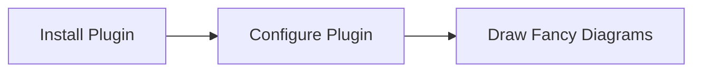

```toc
exclude:TableofContents
from-heading:2
to-heading:6
```

## 第 1 章　 Web 前端技术基础

### 1.1 　现代 Web 前端技术发展概述

**——页面内容多而复杂**



**保证开发效率**：通常，在前端项目实践中，我们需要借助符合特定场景的前端框架来提高开发效率，例如使用 jQuery、MVVM 等开发框架，对常用的 HTMLDOM（DocumentObjectModel，文档对象模型，是指 HTML 内容通过浏览器解析后建立的具有节点父子关系的树形对象）操作进行高效封装，大大简化开发工作量，提高效率。  
**项目的管理和维护**：模块化和组件化  
**快速加载内容**：异步加载数据，图片的优化处理（如使用更高压缩比 webp 格式的图片）  
**合理地利用文件缓存**：这样可以大幅度提高网页资源的加载速度，而且幸运的是，浏览器默认可以支持文件缓存，对于一段时间内浏览器的重复请求，服务器可能会返回 HTTP 的 304 状态码或者不发送请求，让浏览器直接从本地读取内容。

### 1.2 　浏览器应用基础

接收到用户输入的网址后，浏览器会开启一个线程来处理这个请求，对用户输入的 URL 地址进行分析判断，如果是 HTTP 协议就按照 HTTP 方式来处理。○ 　调用浏览器引擎中的对应方法，比如 WebView 中的 loadUrl 方法，分析并加载这个 URL 地址。○ 　通过 DNS 解析获取该网站地址对应的 IP 地址，查询完成后连同浏览器的 Cookie、userAgent 等信息向网站目的 IP 发出 GET 请求。○ 　进行 HTTP 协议会话，浏览器客户端向 Web 服务器发送报文。○ 　进入网站后台上的 Web 服务器处理请求，如 Apache、Tomcat、Node.js 等服务器。○ 　进入部署好的后端应用，如 PHP、Java、JavaScript、Python 等后端程序，找到对应的请求处理逻辑，这期间可能会读取服务器缓存或查询数据库等。○ 　服务器处理请求并返回响应报文，此时如果浏览器访问过该页面，缓存上有对应资源，会与服务器最后修改记录对比，一致则返回 304，否则返回 200 和对应的内容。○ 　浏览器开始下载 HTML 文档（响应报头状态码为 200 时）或者从本地缓存读取文件内容（浏览器缓存有效或响应报头状态码为 304 时）。○ 　浏览器根据下载接收到的 HTML 文件解析结构建立 DOM（DocumentObjectModel，文档对象模型）文档树，并根据 HTML 中的标记请求下载指定的 MIME 类型文件（如 CSS、JavaScript 脚本等），同时设置缓存等内容。○ 　页面开始解析渲染 DOM，CSS 根据规则解析并结合 DOM 文档树进行网页内容布局和绘制渲染，JavaScript 根据 DOMAPI 操作 DOM，并读取浏览器缓存、执行事件绑定等，页面整个展示过程完成。

标注(黄色)-1.2 　浏览器应用基础>位置 425

通常我们认为浏览器主要由七部分组成：用户界面、网络、JavaScript 引擎、渲染引擎、UI 后端、JavaScript 解释器和持久化数据存储。

标注(黄色)-1.2 　浏览器应用基础>位置 456

这里我们要关注的是渲染树的布局阶段和绘制阶段。页面生成后，如果页面元素位置发生变化，就要从布局阶段开始重新渲染，也就是页面重排，所以页面重排一定会进行后续重绘；如果页面元素只是显示样式改变而布局不变，那么页面内容改变将从绘制阶段开始，也称为页面重绘。

标注(黄色)-1.2 　浏览器应用基础>位置 460

渲染引擎对 DOM 渲染树的解析和输出是逐行进行的，所以渲染树前面的内容可以先渲染展示，这样就保证了较好的用户体验。另外也尽量不要在 HTML 显示内容中插入 script 脚本等标签，script 标签内容的解释执行常常会阻塞页面结构的渲染。

标注(黄色)-1.2 　浏览器应用基础>位置 465

Webkit 内核中的 HTML 和 CSS 解析可以认为是并行的；而 Gecko 则是先解析 HTML，生成内容 Sink（ContentSink 可以认为是构建 DOM 结构树的工厂方法）后再开始解析 CSS。

标注(黄色)-1.2 　浏览器应用基础>位置 514

仍需要结合 CSS 规则生成一个带有节点 CSS 样式描述的 DOM 树。

标注(橙色)-1.2 　浏览器应用基础>位置 516

DOM 元素标签是指文本化的 HTML 标识，而 DOM 元素对象则是指经过渲染引擎 DOM 解析后生成的具有节点父子关系的树形对象。

标注(蓝色)-1.2 　浏览器应用基础>位置 530

关于 CSS 规则的权重计算，一般认为是！important>内联样式规则（权重 1000）>id 选择器（权重 100）>类选择器（权重 10）>元素选择器（权重 1）。

标注(黄色)-1.2 　浏览器应用基础>位置 536

数据持久化存储主要是针对浏览器的，所以我们统称为浏览器缓存（

标注(黄色)-1.2 　浏览器应用基础>位置 539

现代浏览器的 8 种缓存机制：HTTP 文件缓存、LocalStorage、SessionStorage、indexDB、WebSQL、Cookie、CacheStorage、ApplicationCache，另外还有一种使用不太多的 Flash 缓存方式。

标注(黄色)-1.2 　浏览器应用基础>位置 547

标注(黄色)-1.2 　浏览器应用基础>位置 551

服务端判断 Etag 未修改则返回状态 304，修改则返回 200，

标注(黄色)-1.2 　浏览器应用基础>位置 554

HTTP 缓存可以在文件缓存生效的情况下让浏览器从本地读取文件，不仅加快了页面资源加载，同时节省网络流量，所以在 Web 站点配置中要尽可能利用缓存来优化请求过程。在

标注(黄色)-1.2 　浏览器应用基础>位置 556

一般这里 CacheControl 设置 maxage 的时间单位是秒，如果同时设置了 Expires 和 CacheControl，则只有 CacheControl 的设置生效。<metahttpequiv="Expires"content="Mon,20Jul201623:00:00GMT"/>

标注(蓝色)-1.2 　浏览器应用基础>位置 570

是，这里的大小限制指的是单个域名下 localStorage 的大小，所以 localStorage 中不适合存放过多的数据，如果数据存放超过最大限制可能会读取报错，

标注(蓝色)-1.2 　浏览器应用基础>位置 577

letrkey=/^[09AZaz_@]\*\$/;letstore;//转换对象 functioninit(){if(typeofstore==='undefined'){store=window['localStorage'];}returntrue;}//判断 localStorage 的 key 值是否合法 functionisValidKey(key){if(typeofkey!=='string'){returnfalse;}returnrkey.test(key);}exports={//设置 localStorage 单条记录 set(key,value){letsuccess=false;if(isValidKey(key)&&init()){try{value+='';store.setItem(key,value);success=true;}catch(e){}}returnsuccess;},//读取 localStorage 单条记录 get(key){if(isValidKey(key)&&init()){try{returnstore.getItem(key);}catch(e){}}returnnull;},//移除 localStorage 单条记录 remove(key){if(isValidKey(key)&&init()){try{store.removeItem(key);returntrue;}catch(e){}}returnfalse;},//清除 localStorage 所有记录 clear(){if(init()){try{for(letkeyinstore){store.removeItem(key);}returntrue;}catch(e){}}returnfalse;}};module.exports=exports;

备注-1.2 　浏览器应用基础>位置 599

loocalsrtoage

标注(粉色)-1.2 　浏览器应用基础>位置 599

单个域名下 localStorage 的大小是有限制的，但是可以用 iframe 的方式使用多个域名来突破单个页面下 localStorage 存储数据的最大限制。


Cookie 的最大长度限制为 4KB

标注(黄色)-1.2 　浏览器应用基础>位置 622

Cookie 设置中有个 HttpOnly 参数，前端浏览器使用 document.cookie 是读取不到 HttpOnly 类型 Cookie 的，被设置为 HttpOnly 的 Cookie 记录只能通过 HTTP 请求头发送到服务器端进行读写操作，这样就避免了服务器端的 Cookie 记录被前端 JavaScript 修改，保证了服务端验证 Cookie 的安全性。

标注(黄色)-1.2 　浏览器应用基础>位置 645

WebSQL 是浏览器端用于存储较大量数据的缓存机制，不过这只有较新版本的 Chrome 浏览器支持该机制，并以一个独立浏览器端数据存储规范的形式出现。

标注(黄色)-1.2 　浏览器应用基础>位置 658

openDatabase()方法可以打开已存在的数据库，并默认创建不存在的数据库。openDatabase()中的五个参数分别为数据库名、版本号、描述、数据库大小、创建回调，即使创建回调为 null 也可以创建数据库，transaction()方法允许我们根据情况控制执行事务提交或回滚，executeSql()则用于执行真实的 SQL 查询语句。

标注(黄色)-1.2 　浏览器应用基础>位置 674

和 WebSQL 类似，目前使用 IndexDB 的实际应用场景也不是很多，而且将大量数据保存到本地也会造成数据泄露，

标注(黄色)-1.2 　浏览器应用基础>位置 687

图 114 　 ApplicationCache 文件访问与更新机制

标注(黄色)-1.2 　浏览器应用基础>位置 727

要了解 cacheStorage，我们必须深入了解一下 ServiceWorker，ServiceWorker 与 WebWorker 一样是在浏览器后台作为一个独立的线程运行的 JavaScript 脚本，可以为浏览器提供并行的计算和数据处理能力，并通过 message/postMessage 方法在页面之间进行通信，但是不能与前端界面进行交互。我们知道 NativeAPP（一般指移动客户端的原生应用）可以做到消息推送、离线使用、自动更新等，同样地，如果使用 ServiceWorker 也可以让 Web 应用具有类似功能。

标注(黄色)-1.2 　浏览器应用基础>位置 759

只有 HTTP 缓存、localStorage 和 Cookie。ServiceWorker 在将来可能会被使用，但目前兼容性的欠缺仍然不能忽视，其他的缓存方式我们仅作为知识了解即可。

标注(黄色)-1.3 　前端高效开发技术>位置 791

自文档化代码的编写也是一个很好的习惯。

标注(黄色)-1.3 　前端高效开发技术>位置 803

用 F12 打开控制台后，

标注(粉色)-1.3 　前端高效开发技术>位置 819

Audits 则可以根据目前页面文档加载和脚本执行情况给出当前前端页面的部分优化建议，这对于前端页面的优化具有极其重要的借鉴意义。

标注(粉色)-1.3 　前端高效开发技术>位置 822

例如，在 Chrome 地址栏中输入 chrome://inspect/#devices 即可查看主机当前连接的移动设备浏览器打开网页的情况，并可以阅读 DOM 结构和查看 Debug 信息。

标注(粉色)-1.3 　前端高效开发技术>位置 831

Fiddler，

标注(蓝色)-1.3 　前端高效开发技术>位置 844

服务端开发调试的工具也比较多。例如 nodesupervisor、nodeinspector 及以后可能出现的新工具。这类工具入门很简单，

第 2 章　前端与协议

标注(黄色)-位置 892

基于 SSL（SecureSocketsLayer，安全套接字层）层的 HTTPS 协议。

标注(黄色)-位置 894

与移动端 Native 原生程序交互的协议。

标注(黄色)-位置 894

HTML5 的 WebSocket 实时通信协议、与服务端交互的 RESTful 协议等。

标注(黄色)-2.1 　 HTTP 协议简介>位置 897

HTTP（HyperTextTransportProtocol，超文本传输协议）协议是 WWW 服务器和用户请求代理（例如浏览器等）之间通过应答请求模式传输超文本（例如 HTML 文件、JavaScript 文件、CSS 文件、图片甚至服务器接口数据等）内容的一种协议，

标注(蓝色)-2.1 　 HTTP 协议简介>位置 900

浏览器（用户请求代理）向服务器发送请求时头部中包含请求的方法 GET、URL（UniformResourceLocation，统一资源定位符）http://www.jixianqianduan.com/、协议版本号1.1、请求头域字段（如请求接受类型Accept）、缓存控制CacheControl、浏览器Cookie和userAgent信息等，同时也可能会带上请求的正文内容。

标注(蓝色)-2.1 　 HTTP 协议简介>位置 903

响应的内容包括 HTTP 消息响应的协议版本 1.1、返回码 304 及返回描述 NotModified、缓存控制信息 CacheControl 以及正文的 HTML 内容等，

标注(蓝色)-2.1 　 HTTP 协议简介>位置 908

通常一个完整的 HTTP 报文由头部、空行、正文三部分组成。空行用于区分报文头部和报文正文，由一个回车符和一个换行符组成。

标注(黄色)-2.1 　 HTTP 协议简介>位置 920

提到 HTTP1.1 协议，我们首先想到的一个重要特性就是长连接。

标注(蓝色)-2.1 　 HTTP 协议简介>位置 924

但是在 HTTP1.1 协议中，任何 HTTP 请求的报文头部域都会默认包含 keepalive.keepalive 的控制可以让客户端到服务器端之间的连接在一段时间内持续有效，

标注(黄色)-2.1 　 HTTP 协议简介>位置 933

例如 WebSocket 协议就是典型的应用，WebSocket 协议通信是通过 HTTP 的方式来建立的，通信连接建立完成后通知服务器切换到 WebSocket 协议来完成后面的数据通信。

标注(蓝色)-2.1 　 HTTP 协议简介>位置 936

通信，如果服务端支持 WebSocket 服务并允许该客户端来连接，则可以在响应报文头中返回 Upgrade 和 Connection 消息头域，同意浏览器使用 WebSocket 来连接，同时返回的状态码为 101 表示请求还需要完成协议的切换。

标注(黄色)-2.1 　 HTTP 协议简介>位置 941

HTTP1.1 增加了 CacheControl 头域，可以支持 maxage 用来表示相对过期时间，另外请求服务器时也可以根据 Etag 和 LastModified 来判断是否从浏览器端缓存中加载文件，此时缓存的控制和判断将决定服务器的响应报文中头部内容的状态码 200 还是 304。

标注(黄色)-2.1 　 HTTP 协议简介>位置 951

这就是 CacheControl、Etag 和 LastModified 控制请求缓存的

标注(黄色)-2.1 　 HTTP 协议简介>位置 954

部分内容传输优化指 HTTP 可以支持超文本文件的部分传输，

标注(黄色)-2.1 　 HTTP 协议简介>位置 993

Etag：对象（比如 URL）的标志值。一个对象（如 HTML 文件）如果被修改了，其 Etag 也会被修改，所以 Etag 的作用和 LastModified 差不多，主要供 Web 服务器判断一个对象是否改变。例如前一次请求某个 HTML 文件时获得了其 Etag，当这次又请求该文件时，浏览器就会把先前获得的 Etag 值发送给 Web 服务器，然后 Web 服务器会将这个 Etag 值跟该文件当前的 Etag 值进行对比，判断文件是否改变。

标注(橙色)-2.1 　 HTTP 协议简介>位置 1024

SPDY 是一种基于 HTTP 的兼容协议，由 Google 发起，Chrome、Opera、Firefox 等较新的浏览器已提供该协议支持。SPDY 传输支持多路复用和服务器推送技术，压缩了 HTTP 头部减小了请求大小，并强制使用 SSL 传输协议，到目前为止已经成为了一套成熟的高效协议标准。

标注(蓝色)-2.1 　 HTTP 协议简介>位置 1030

HTTP2 采用完全二进制的格式来传输数据，而非 HTTP1.x 的默认文本格式。而二进制在网络中传输的基本单位一般为帧（

标注(蓝色)-2.1 　 HTTP 协议简介>位置 1035

HTTP2 使用 TCP 多路复用的方式来降低网络请求连接建立和关闭的开销，

备注-2.1 　 HTTP 协议简介>位置 1036

采用多路复用技术能把多个信号组合起来在一条物理信道上进行传输，在远距离传输时可大大节省电缆的安装和维护费用。频分多路复用 FDM(FrequencyDivisionMultiplexing)和时分多路复用 TDM(TimeDivisionMultiplexing)是两种最常用的多路复用技术。

标注(蓝色)-2.1 　 HTTP 协议简介>位置 1038

这里我们有必要明确一下 TCP 连接复用和 HTTP1.1 中 keepalive 连接复用的区别：TCP 复用传输是发生在传输层的，而 keepalive 控制的文件的连接复用是在应用层的；keepalive 的连接复用是串行的，即一个文件传输完后，下个文件才能复用这个连接，

标注(黄色)-2.2 　 web 安全机制>位置 1059

XSS（CrossSiteScript，跨站脚本攻击）、SQL（StructuredQueryLanguage，结构化查询语言）注入和 CSRF（CrosssiteRequestForgery，跨站请求伪造）均属于基础的前端安全知识，逐个来看一下。

标注(黄色)-2.2 　 web 安全机制>位置 1061

XSS 通常是由带有页面可解析内容的数据未经处理直接插入到页面上解析导致的。

标注(黄色)-2.2 　 web 安全机制>位置 1062

XSS 分为存储型 XSS、反射型 XSS、MXSS（也叫 DOMXSS）三种。

标注(黄色)-2.2 　 web 安全机制>位置 1063

存储型 XSS 的攻击脚本常常是由前端提交的数据未经处理直接存储到数据库然后从数据库中读取出来后又直接插入到页面中所导致的；反射型 XSS 可能是在网页 URL 参数中注入了可解析内容的数据而导致的，如果直接获取 URL 中不合法的并插入页面中则可能出现页面上的 XSS 攻击；MXSS 则是在渲染 DOM 属性时将攻击脚本插入 DOM 属性中被解析而导致的。XSS 主要的防范方法是验证输入到页面上所有内容来源数据是否安全，如果可能含有脚本标签等内容则需要进行必要的转义。具体看下面几个例子。

标注(蓝色)-2.2 　 web 安全机制>位置 1077

一般的做法是将所有可能包含攻击的内容进行 HTML 字符编码转义，目前的 HTML 字符编码解码就可以如下实现。

标注(蓝色)-2.2 　 web 安全机制>位置 1089

SQL 注入攻击主要是因为页面提交数据到服务器端后，在服务器端未进行数据验证就将数据直接拼接到 SQL 语句中执行，因此产生执行与预期不同的现象。主要防范措施是对前端网页提交的数据内容进行严格的检查校验。

标注(黄色)-2.2 　 web 安全机制>位置 1095

CSRF 是指非源站点按照源站点的数据请求格式提交非法数据给源站点服务器的一种攻击方法。

标注(黄色)-2.2 　 web 安全机制>位置 1098

通常比较安全的是通过页面 Token（令牌）提交验证的方式来验证请求是否为源站点页面提交的，来阻止跨站伪请求的发生。

标注(蓝色)-2.2 　 web 安全机制>位置 1108

其中一种形式是将页面提交到后台的验证 Token 与 session 临时保存的 Token 进行比较就可以来实现了。

标注(蓝色)-2.2 　 web 安全机制>位置 1114

标注(黄色)-2.2 　 web 安全机制>位置 1122

网络请求劫持的发生也越来越频繁。网络劫持一般指网站资源请求在请求过程中因为人为的攻击导致没有加载到预期的资源内容。网络请求劫持目前主要分为两种：DNS 劫持与 HTTP 劫持。

标注(黄色)-2.2 　 web 安全机制>位置 1125

取得某域名的解析记录控制权，进而修改此域名的解析结果，导致用户对该域名地址的访问由原 IP 地址转入到修改后的指定 IP 地址的现象，

标注(黄色)-2.2 　 web 安全机制>位置 1136

一般用户请求源网站的 IP 地址及网站加载的内容和脚本都是正确的，但是在网站内容请求返回的过程中，可能被 ISP（InternetServiceProvider，互联网服务提供商）劫持修改，最终在浏览器页面上添加显示一些广告等内容信息。

标注(黄色)-2.2 　 web 安全机制>位置 1141

HTTPS 协议是通过加入 SSL（SecureSocketsLayer）层来加密 HTTP 数据进行安全传输的 HTTP 协议，同时启用默认的 443 端口进行数据传输。

标注(黄色)-2.2 　 web 安全机制>位置 1142

HTTPS 是怎样保证浏览器和服务器之间数据安全传输的呢？我们需要先理解两个概念：公钥和私钥。

标注(黄色)-2.2 　 web 安全机制>位置 1148

客户端在需要使用 HTTPS 请求数据时，首先会发起连接请求，告诉服务器将建立 HTTPS 连接；服务器收到通知后自己生成一个公钥并将它返回给客户端，如果是第一次请求，同时还要告诉客户端需要进行连接验证；如果需要验证，客户端接收到服务器公钥后开始发送验证请求，将一个特定的验证串使用服务器返回的公钥加密后形成密文发送给服务器，同时客户端也将自己生成的公钥发送给服务器；服务器获取到加密的报文和客户端公钥，先使用服务器私钥解密报文获得验证串，然后将验证串通过接收到的客户端公钥加密后返回给客户端；客户端再通过私钥解密验证串，判断是否为自己开始发送的验证串；如果正确，说明双方的连接是安全的，连接验证成功，客户端开始将后面的数据通过服务器初始返回的公钥不断加密发送给服务器，服务器也不断解密获取报文，并通过客户端公钥加密响应的报文内容返回给客户端验证。这样就建立了 HTTPS 双向的加密传输连接。

标注(黄色)-2.2 　 web 安全机制>位置 1158

HTTPS 的请求只能被添加了对应数字证书的应用层代理拦截，

标注(黄色)-2.2 　 web 安全机制>位置 1159

Node 端就可以用以下方法来实现。//引入 https 模块 consthttpsModule=require('https');constfs=require('fs');//加载网站 https 服务证书文件，证书一般需要注册申请 consthttps=httpsModule.Server({key:fs.readFileSync('/path/to/server.key'),cert:fs.readFileSync('/path/to/server.crt')},function(req,res){res.writeHead(200);res.end("helloworld\n");});//https 默认监听端口 443https.listen(443,function(err){console.log("httpslisteningonport:443");});当然，如果使用 Web 框架，也可以通过更简单的方式创建一个 HTTPS 服务器。constkoa=require('koa');constapp=koa();//同时监听多个端口 app.listen(80);app.listen(443);

标注(黄色)-2.2 　 web 安全机制>位置 1169

RemoteAddress:192.30.252.131:443

标注(黄色)-2.2 　 web 安全机制>位置 1171

upgradeinsecurerequests，

标注(黄色)-2.2 　 web 安全机制>位置 1172

使用 HTTPS 来加载 HTML 文件，而 HTML 中加载的是 HTTP 链接的资源文件，则会产生 MixedContent 类型的错误，

标注(黄色)-2.2 　 web 安全机制>位置 1189

很多浏览器内置了一个配置 STS 的站点列表，

标注(黄色)-2.2 　 web 安全机制>位置 1204

blockallmixedcontent 就是之前提到的，HTTPS 请求的 HTML 会控制阻塞外部 HTTP 资源的文件加载。

标注(黄色)-2.2 　 web 安全机制>位置 1212

AccessControlAllowOrigin 常常作为跨域共享设置的一种实现方式，其他常用的跨域手段还有：JSONP(JSONwithPadding)、script 标签跨域、window.postMessage、修改 document.domain 跨子域、window.name 跨域和 WebSocket 跨域等。

标注(黄色)-2.3 　前端实时协议>位置 1222

目前可用来在前端浏览器上进行实时通信的功能实现方式主要有 WebSocket、Poll、Longpoll 和 DDP 协议。

标注(黄色)-2.3 　前端实时协议>位置 1238

0x8 表示连接关闭；○ 　 0x9 表示 ping；

标注(黄色)-2.3 　前端实时协议>位置 1242

值得注意的是，WebSocket 在网络中传输的最小单位也为帧，

标注(黄色)-2.3 　前端实时协议>位置 1260

Longpoll 目前一个很典型的应用场景就是网站通过对应的移动客户端进行扫描二维码登录，即用户使用移动客户端扫描二维码登录网站，成功后桌面浏览器页面自动响应跳转进入一个新的登录后页面。

标注(黄色)-2.3 　前端实时协议>位置 1266

差别。图 216 　二维码扫描登录跳转原理 function_getQrAuth(){

标注(黄色)-2.5 　与 Native 交互协议>位置 1377

首先来看一下 HybridApp 中如何通过 URI 请求在 HTML5 前端页面中来调用一个 Native 的方法或界面。其主要原理是，Native 应用可在移动端系统中注册一个 Scheme 协议的 URI，这个 URI 可在系统的任意地方授权访问来调起一段原生方法或一个原生的界面。

第 3 章　前端三层结构与应用

标注(黄色)-位置 1481

简单来讲，例如 HTML 开发可以由 Component（实现的形式较多，例如 WebComponent、目录级 Component、其他框架自定义形式的 Component）来管理结构，CSS 由 SASS、postCSS、stylus 等预处理器的语法开发来代替，JavaScript 则使用 ECMAScript6+、TypeScript 等特性标准进行高效开发。

标注(黄色)-3.1 　 HTML 结构层基础>位置 1509

Web 语义化是指在 HTML 结构的恰当位置上使用语义恰当的标签，使页面具有良好的结构，使页面标签元素具有含义，能够让人或搜索引擎更容易理解。

标注(黄色)-3.1 　 HTML 结构层基础>位置 1554

CSS 规范规定：每个标签元素都是有 display 属性的。

标注(黄色)-3.1 　 HTML 结构层基础>位置 1578

再如页面中使用<table>这个语义化标签是会导致内容渲染较慢的，因为<table>里面的内容渲染是等表格内容全部解析完生成渲染树后一次性渲染到页面上的，如果表格内容较多，就可能产生渲染过程较慢的问题，因此我们常常需要通过其他的方式来模拟<table>元素，例如使用无序列表来模拟表格。

标注(黄色)-3.1 　 HTML 结构层基础>位置 1598

实际项目开发中，我们常常把<i>元素标签当作页面上的 icon 图标标签来使用>

标注(黄色)-3.1 　 HTML 结构层基础>位置 1615

标签的 alt 属性和 title 属性是有区别的，alt 属性一般表示图片加载失败时提示的文字内容，title 属性则指鼠标放到元素上时显示的提示文字。在页面结构书写中，我们常用 title 来提示一些省略掉的文字的全部内容。例如<ptitle="这是一段很长的文字，包含很多内容">这是一段很长的文字…</p>，这样在页面中可能只展示部分文字，但用户可以通过鼠标提示看到这段文字的完整内容，这对

标注(黄色)-3.1 　 HTML 结构层基础>位置 1636

不同的是 AMPHTML 是通过自定义元素完成 Component 来实现的，懒加载则是通过 JavaScript 直接在网页中操作实现。

标注(黄色)-3.1 　 HTML 结构层基础>位置 1638

浏览器同一个域名的最大并行下载线程个数是有限的，所以我们常常要先加载页面的关键性展示资源，延后加载页面脚本类资源或页面的非关键性图片资源。一般浏览器（IE8 以上）对同一个域名下的资源最多支持 4 ～ 6 个并行下载数，所以为了增大资源下载并行数，我们常常将 HTML、JavaScript、CSS、图片资源分域存放。分域也可以将静态资源请求进行服务器端的负载均衡，并对请求中的 cookie 信息进行隔离，因为跨域请求默认是不带 Cookie 的，这样便减小了 JavaScript、CSS、图片等资源的请求头部信息大小，从而提升了请求的解析速度。

标注(黄色)-3.1 　 HTML 结构层基础>位置 1654

使用 AMP 提升页面性能的基本的原则如下。○ 　只允许异步的 script 脚本 ○ 　只加载静态的资源 ○ 　不能让内容阻塞渲染 ○ 　不在关键路径中加载第三方 JavaScript○ 　所有的 CSS 必须内联 ○ 　字体使用声明必须高效 ○ 　最小化样式声明 ○ 　只运行 GPU 加速的动画 ○ 　处理好资源加载顺序问题 ○ 　页面必须立即加载 ○ 　提升 AMP 元素性能

标注(黄色)-3.2 　前端结构层演进>位置 1706

曾经我们甚至一度认为前端页面技术就是 CSS+DIV 技术，当然这是在前端技术发展早期，HTML 的元素主要分为行内、块级和常见空元素几类。

标注(黄色)-3.2 　前端结构层演进>位置 1713

目前由于移动端浏览器内核具有相对较好的统一性和兼容性，所以 HTML5 主要用于移动端页面的开发。

标注(黄色)-3.2 　前端结构层演进>位置 1772

也就是说，你自己写的 CSS 选择器和 JavaScript 代码都不会影响到 ShadowDOM 里面的内容。实质上就是让<video>标签里的逻辑和样式都被浏览器单独封装并与外界元素独立，而<video>标签内容在浏览器上的渲染则是在浏览器结构 UI 后端模块中设置的。

标注(黄色)-3.2 　前端结构层演进>位置 1775

ShadowDOM 是 HTML 的一个规范，它允许浏览器开发者封装自己的 HTML 标签、CSS 样式和特定的 JavaScript 代码，同时也可以让开发人员创建类似<video>这样的自定义一级标签，创建这些新标签内容和相关的 API 被称为 WebComponent。这里提出了 ShadowDOM 和 WebComponent

标注(黄色)-3.4 　 JavaScript 标准实践>位置 2068

三是使用 let、const 在全局作用域下声明的变量不会作为属性添加到全局作用域对象里面，这点和 var 是不同的；四是通过测试，使用 let、const 赋值语句的执行速度比使用 var 快约 65%左右。

标注(黄色)-3.4 　 JavaScript 标准实践>位置 2070

区别：模块内不变的引用和常量，一般使用 const 定义；可变的变量或引用使用 let 声明；var 仅用于声明函数整个作用域内需要使用的变量。

标注(黄色)-3.4 　 JavaScript 标准实践>位置 2079

的。解构赋值个人

标注(黄色)-3.4 　 JavaScript 标准实践>位置 2089

需要注意的是，这里的…进行的数组复制是浅拷贝（

标注(黄色)-3.4 　 JavaScript 标准实践>位置 2128

在 JavaScript 中，代码的执行上下文由变量对象、作用域链和 this 值组成。但箭头函数与外层执行上下文共享 this 值。如果需要创建具有独立上下文的函数，就不要使用箭头函数。

标注(黄色)-3.4 　 JavaScript 标准实践>位置 2164

所以数组循环遍历最佳方式是 for...of，此外 for...of 也可以用来遍历 Map、Set、WeakMap、WeakSet 等集合。

标注(黄色)-3.4 　 JavaScript 标准实践>位置 2167

纯函数一般指返回值完全由传入的参数来决定的函数，即对于同一个参数输入，在任何情况下的函数返回结果都是相同且唯一的。例如数组的 slice()可以认为是一个纯函数，而 random()则不是纯函数。

标注(黄色)-3.4 　 JavaScript 标准实践>位置 2181

我们可以把 Interator 理解成为数组或对象上的一个根据偏移来访问内存内容的游标对象，每次调用 next()，遍历游标会向后移动一个地址。


代码很浅显易懂，不过需要注意的是，Generator 遇到 yield 关键字会暂停往后执行，但并不表示后面的程序就不执行了。如果 console.log(number)是一个耗时的工作，那么程序只在 Generator 里面暂停，外面的程序仍会继续执行，


如果一定要对应来看，Set 可以认为是增强的数组类型，Map 则可以认为是增强的对象类型，WeakSet 和 WeakMap 则对应着 Set 和 Map 的优化类型，所以某种程度上，为了让程序开发更加方便，我们有必要引入集合这类更为高效的类型。WeakSet 和 WeakMap 在生成时有更加严格的限制：WeakSet 只存储对象类型的元素，不能遍历，没有 size 属性；WeakMap 只接受基本类型的值作为键名，没有 keys、values、entries 等遍历方法，也没有 size 属性。


需要注意的是，Map 和 Set 都为内部的每个键或值保持了强引用，也就是说，如果一个存储的属性元素被移除了，回收机制可能无法回收它占用的内存，容易造成内存泄露，所以我们使用时要尽可能先删除引用的相关内容。相比之下，使用 WeakSet 和 WeakMap 则不会出现上述情况，因为它们并不使用强引用。再总结一下 JavaScript 可能出现内存泄露的常见场景：闭包函数、全局变量、对象属性循环引用、DOM 节点删除时未解绑事件、Map 和 Set 的属性直接删除。希望大家同时也要明白上述五种场景的具体情况是怎么样的。
